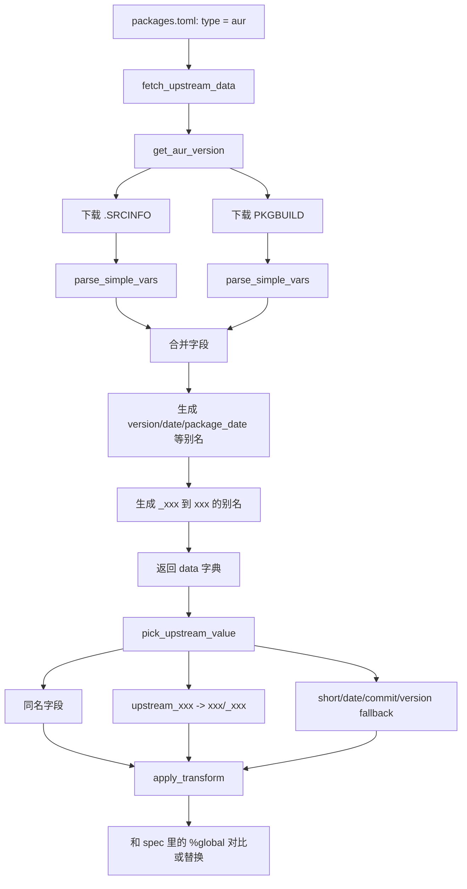

# AUR 字段解析流程

这份文档说明 `scripts/common.py` 里 AUR 包的上游字段是怎么解析出来的，以及 `packages/packages.toml` 里的 `transforms` 如何引用这些字段。

目标是：**以后 AUR 包需要新增一个版本相关字段时，尽量只改 `packages.toml` 和 `.spec`，不要再改 `common.py`。**

---

## 1. AUR 包的数据从哪里来

当某个包配置为：

```toml
[antigravity]
type = "aur"
repo = "antigravity"
spec = "packages/antigravity/antigravity.spec"
transforms = { package_version = "strip_v", upstream_build = "raw" }
```

脚本会调用：

```python
fetch_upstream_data(config)
```

因为 `type = "aur"`，它会继续调用：

```python
get_aur_version(config["repo"])
```

也就是：

```python
get_aur_version("antigravity")
```

---

## 2. `get_aur_version()` 会下载哪些文件

对于 AUR 包，脚本会从 AUR cgit 下载两个文件：

```text
https://aur.archlinux.org/cgit/aur.git/plain/.SRCINFO?h=<pkgname>
https://aur.archlinux.org/cgit/aur.git/plain/PKGBUILD?h=<pkgname>
```

例如 `antigravity`：

```text
https://aur.archlinux.org/cgit/aur.git/plain/.SRCINFO?h=antigravity
https://aur.archlinux.org/cgit/aur.git/plain/PKGBUILD?h=antigravity
```

为什么要同时读两个？

- `.SRCINFO`：包含 AUR 公开的、已经展开过的包元数据，比如 `pkgver`、`pkgrel`、`pkgdesc`。
- `PKGBUILD`：包含打包脚本自身的变量，尤其是 `_build`、`_commit`、`_pkgver` 这类私有辅助变量。

有些对 Fedora spec 有用的字段只存在于 `PKGBUILD`，不会出现在 `.SRCINFO` 里，例如 Antigravity 的：

```bash
_build=5119448496078848
```

---

## 3. 哪些字段会被解析

脚本会用 `parse_simple_vars()` 扫描 `.SRCINFO` 和 `PKGBUILD` 中的简单变量赋值。

会解析这种：

```bash
pkgver=2.0.10
pkgdate=2026/02
_build=5119448496078848
_commit=abcdef1234567890
_source_date='20260602'
```

不会解析这种：

```bash
source=(foo.tar.gz bar.patch)
depends=(gtk3 nss)
pkgver() { ... }
_build=$(curl ...)
_hash=`git rev-parse HEAD`
```

跳过数组、命令替换和函数的原因是：

- 它们不是简单标量值；
- 直接用正则解析 shell 语法容易误判；
- spec 宏更新通常只需要版本号、日期、commit、build id 这类简单值。

---

## 4. 解析顺序和覆盖规则

`get_aur_version()` 的核心流程是：

```python
data = parse_simple_vars(srcinfo)
data.update(parse_simple_vars(pkgbuild))
```

也就是说：

1. 先解析 `.SRCINFO`
2. 再解析 `PKGBUILD`
3. 如果两个文件里有同名字段，`PKGBUILD` 的值会覆盖 `.SRCINFO`

这样做是为了保留 `.SRCINFO` 的公开元数据，同时允许 `PKGBUILD` 中的辅助变量参与更新判断。

---

## 5. 自动生成的通用别名

解析完简单变量后，脚本会额外生成一些常用别名。

### 5.1 `pkgver` -> `version`

AUR 的版本字段通常叫：

```bash
pkgver=2.0.10
```

脚本会额外生成：

```python
{
    "pkgver": "2.0.10",
    "version": "2.0.10"
}
```

这样 release 型包默认的：

```toml
transforms = { package_version = "strip_v" }
```

就可以继续从 `version` 取值。

### 5.2 `pkgdate` -> `date` / `package_date`

如果 AUR 里有：

```bash
pkgdate=2026/02
```

脚本会额外生成：

```python
{
    "pkgdate": "2026/02",
    "date": "2026/02",
    "package_date": "2026/02"
}
```

这兼容了类似 `steamcommunity302` 这种配置：

```toml
transforms = { package_version = "strip_v", package_date = "raw" }
```

### 5.3 `_xxx` -> `xxx`

AUR PKGBUILD 里经常用下划线开头表示私有辅助变量，例如：

```bash
_build=5119448496078848
_commit=abcdef1234567890
```

脚本会额外生成去掉前导下划线的别名：

```python
{
    "_build": "5119448496078848",
    "build": "5119448496078848",
    "_commit": "abcdef1234567890",
    "commit": "abcdef1234567890"
}
```

所以后续配置里通常不用写 `_build`，写 `build` 或 `upstream_build` 更适合 spec 语义。

---

## 6. `upstream_xxx` 如何匹配 AUR 字段

`packages.toml` 里的 `transforms` 的 key 是 spec 里的 `%global` 宏名。

例如 spec 里有：

```spec
%global upstream_build 5119448496078848
```

配置就写：

```toml
transforms = { package_version = "strip_v", upstream_build = "raw" }
```

当 `pick_upstream_value(data, "upstream_build")` 找值时，顺序是：

1. 先找同名字段：`data["upstream_build"]`
2. 如果宏名以 `upstream_` 开头，再取后缀 `build`
3. 尝试：`data["build"]`
4. 再尝试：`data["_build"]`
5. 还没有才进入 `short` / `date` / `commit` / `version` 等通用 fallback

所以 Antigravity 的 AUR 字段：

```bash
_build=5119448496078848
```

可以自动匹配 spec 宏：

```spec
%global upstream_build 5119448496078848
```

配置只需要：

```toml
transforms = { package_version = "strip_v", upstream_build = "raw" }
```

---

## 7. 完整例子：Antigravity

AUR `PKGBUILD` 片段：

```bash
pkgver=2.0.10
_build=5119448496078848
source_x86_64=(Antigravity-$pkgver-x86_64.tar.gz::https://storage.googleapis.com/antigravity-public/antigravity-hub/$pkgver-$_build/linux-x64/Antigravity.tar.gz)
```

脚本解析后得到的关键数据：

```python
{
    "pkgver": "2.0.10",
    "version": "2.0.10",
    "_build": "5119448496078848",
    "build": "5119448496078848"
}
```

`packages.toml`：

```toml
[antigravity]
type = "aur"
repo = "antigravity"
spec = "packages/antigravity/antigravity.spec"
copr_repos = ["ikunji/mycopr", "ikunji/antigravity"]
transforms = { package_version = "strip_v", upstream_build = "raw" }
```

spec：

```spec
%global package_version 2.0.10
%global upstream_build 5119448496078848
```

判断更新时：

| spec 宏 | 上游取值来源 | transform | 期望值 |
| :--- | :--- | :--- | :--- |
| `package_version` | `version` / `pkgver` | `strip_v` | `2.0.10` |
| `upstream_build` | `build` / `_build` | `raw` | `5119448496078848` |

---

## 8. 新增 AUR 字段时应该怎么做

优先按这个顺序处理：

### 情况 A：AUR 里已有简单变量

如果 PKGBUILD 里已经有：

```bash
_upstream_hash=abcdef
```

spec 里想维护：

```spec
%global upstream_hash abcdef
```

只需要在 `packages.toml` 写：

```toml
transforms = { package_version = "strip_v", upstream_hash = "raw" }
```

不用改 `common.py`。

### 情况 B：变量名完全一致

如果 PKGBUILD 或 `.SRCINFO` 里有：

```bash
channel=stable
```

spec 里也叫：

```spec
%global channel stable
```

配置写：

```toml
transforms = { package_version = "strip_v", channel = "raw" }
```

脚本会直接同名匹配。

### 情况 C：需要清洗格式

如果上游值是：

```bash
_tag=v1.2.3
```

spec 里希望是：

```spec
%global upstream_tag 1.2.3
```

配置写：

```toml
transforms = { upstream_tag = "strip_v" }
```

`upstream_tag` 会匹配 `_tag` / `tag`，然后 `strip_v` 会去掉前面的 `v`。

---

## 9. 什么时候仍然需要改 `common.py`

以下情况可能仍然需要改脚本：

1. 字段不是简单赋值，而是函数动态计算出来的，例如 `pkgver() { ... }`。
2. 字段值来自命令替换，例如 `_build=$(curl ...)`。
3. 需要解析数组里的某个值，例如 `source_x86_64=(...)`。
4. 需要从上游网页、API、JSON 里二次提取，而不是从 AUR 变量直接拿。
5. 需要新增 transform 操作，例如 `replace_regex`、`lowercase`、`split`。

如果只是 AUR 里新增了一个简单变量，通常不需要改 `common.py`。

---

## 10. 当前 AUR 字段解析流程图


